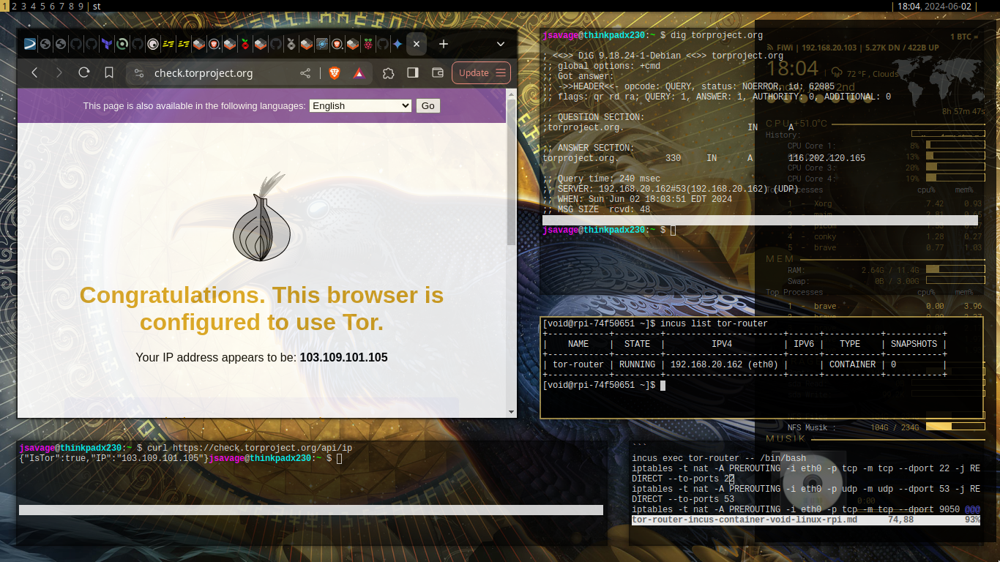

1. Create a macvlan network if one doesn't already exist
```
incus network create macvlan parent=eth0 --type macvlan
```

1. Launch a new void linux incus container with a macvlan network type
```
[void@rpi-74f50651 ~]$ incus launch images:voidlinux/musl tor-router --network macvlan
Launching tor-router
[void@rpi-74f50651 ~]$
[void@rpi-74f50651 ~]$ incus list
+---------------+---------+-----------------------+------+-----------+-----------+
|     NAME      |  STATE  |         IPV4          | IPV6 |   TYPE    | SNAPSHOTS |
+---------------+---------+-----------------------+------+-----------+-----------+
| tor-router    | RUNNING | 192.168.20.162 (eth0) |      | CONTAINER | 0         |
+---------------+---------+-----------------------+------+-----------+-----------+
```

1. Enter the container and install tor, torsucks, curl (torsocks and curl are just for validation)
```
xbps-install -Sy tor torsocks curl
```

2. Enable the tor service, check the status, and verify tor is listening on port 9050
```
bash-5.2# ln -sv /etc/sv/tor /var/service
'/var/service/tor' -> '/etc/sv/tor'

bash-5.2# sv status tor
run: tor: (pid 5713) 6s; run: log: (pid 5712) 6s

bash-5.2# ss -ltn
State     Recv-Q    Send-Q         Local Address:Port         Peer Address:Port
LISTEN    0         4096               127.0.0.1:9050              0.0.0.0: *
```
3. Test and validate tor connection with torsocks
```
bash-5.2# torsocks curl https://check.torproject.org/api/ip
{"IsTor":true,"IP":"23.137.253.110"}
```

2. Create log directory: /var/log/tor 
```
mkdir /var/log/tor
```

4. Reconfigure /etc/tor/torrc configuration on the container
```
# /etc/tor/torrc
Log notice file /var/log/tor/notices.log
VirtualAddrNetwork 172.16.0.0/12
AutomapHostsSuffixes .onion,.exit
AutomapHostsOnResolve 1
TransPort $LISTEN_ADDR:9040
SocksPort $LISTEN_ADDR:9050
DNSPort $LISTEN_ADDR:53
ControlPort 9051
CookieAuthentication 1
```

The IP address ($LISTEN_ADDR) should be whatever the IP Address of the tor container is..

I like to push the new torrc config to the container from the host, then restart the container, check status, etc
```
incus file push conf/torrc /etc/tor/torrc
incus exec tor-router -- sv restart tor
incus exec tor-router -- sv status tor
incus exec tor-router -- ss -ltn
```

5. Next - enter the container again and setup some iptables rules to forward the TCP traffic to Tor
```
incus exec tor-router -- /bin/bash
iptables -t nat -A PREROUTING -i eth0 -p tcp -m tcp --dport 22 -j REDIRECT --to-ports 22
iptables -t nat -A PREROUTING -i eth0 -p udp -m udp --dport 53 -j REDIRECT --to-ports 53
iptables -t nat -A PREROUTING -i eth0 -p tcp -m tcp --dport 9050 -j REDIRECT --to-ports 9050
iptables -t nat -A PREROUTING -i eth0 -p tcp -m tcp --tcp-flags FIN,SYN,RST,ACK SYN -j REDIRECT --to-ports 9040
```

That's it - now configure clients to use the tor-router container ip address as the default gateway and DNS server.


